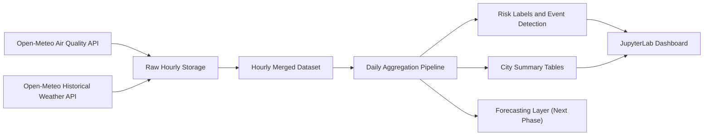

# System Architecture

## Overview

The project follows a simple but serious analytical architecture that separates ingestion, transformation, feature engineering, and decision-support views.

## Main Layers

### 1. Data Ingestion Layer

- fetches hourly air-quality variables
- fetches hourly weather variables
- stores raw CSV snapshots locally

### 2. Harmonized Hourly Layer

- merges air-quality and weather records by city and timestamp
- keeps a traceable analytical base table
- supports reprocessing without re-authoring notebooks

### 3. Daily Feature Layer

- aggregates hourly readings into daily metrics
- computes means, maxima, percentiles, totals, and observation counts
- creates a stable modeling layer for later forecasting tasks

### 4. Risk and Event Layer

- assigns AQI-based risk labels
- flags pollution episodes
- identifies dominant pollutant pressure by day

### 5. Decision-Support Layer

- city comparison
- trend exploration
- risk-day ranking
- latest operational snapshot

## Dataset Strategy

The project intentionally keeps both hourly and daily layers:

- the hourly layer is needed for granular exploration and later multi-step forecasting
- the daily layer is better for early warning summaries, robustness, and operational interpretation

## Planned Extension

The forecasting phase will use the daily feature layer to predict:

- PM2.5 daily mean
- PM2.5 daily max
- European AQI daily max

Possible next-phase models:

- Naive baseline
- Drift or linear trend
- ARIMA
- Random Forest
- Gradient boosting
